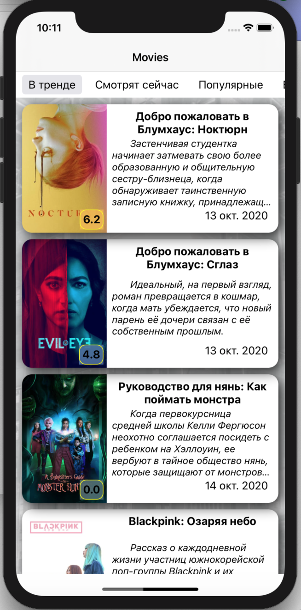
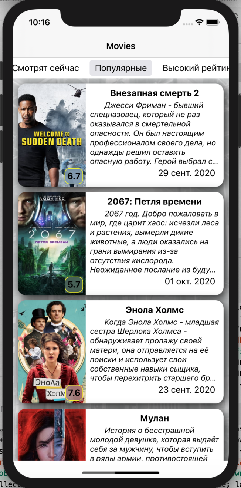
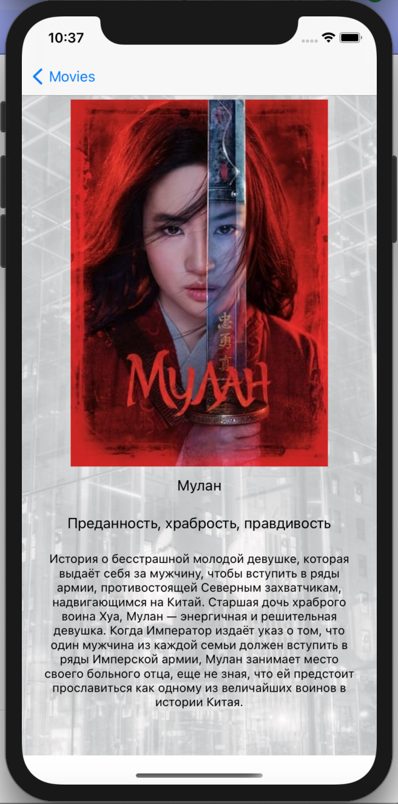

# MoviesGO
If you are a movie fan, welcome to Movies GO

## Requirements
- XCode 12.0.1
- Swift 5.3

## Architecture and technology stack
- UIKit
- MVVM
- Router
- AssemblyBuilder
- Storyboard
- InterfaceBuilder
- Autolayout
- UICollectionView
- ARC
- URLSession
- Decodable
- Public API Themoviedb.org
- Кэширование UIImage in Dictionary to menuCollectionViewCell
- Continuous scrolling to menuCollectionView
- SOLID
- Unit test

## Screenshots MainView
**iPhone 11**  

## Screenshots DescriptionView
**iPhone 11**  

## Improvement plans
- Image caching
- Search string
- Localization app

## Date changes file README.md
2020/10/15
